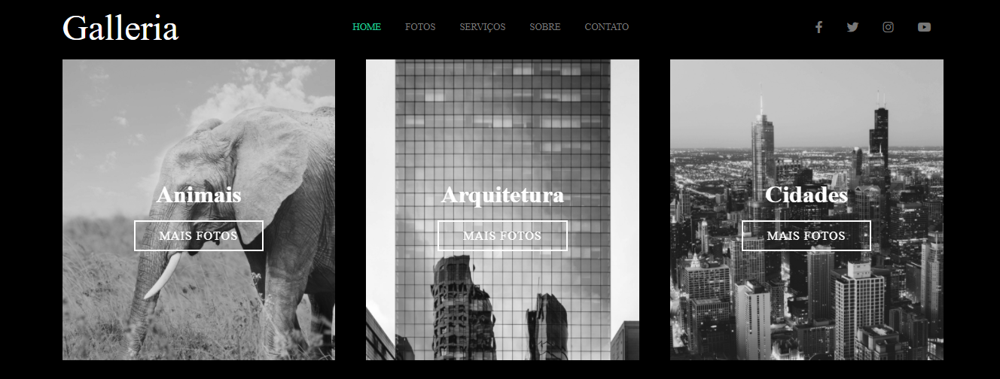
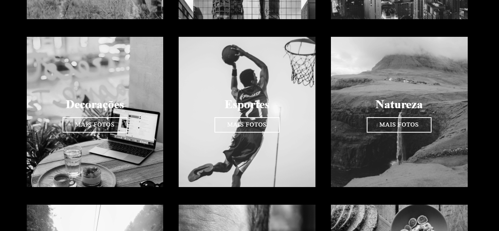
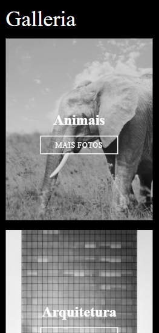
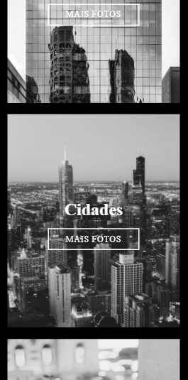
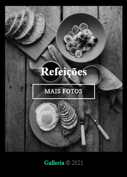

# Gallery
Projeto de uma galeria de fotos usando SASS.

## Versão Desktop:

## Versão mobile (Em construção)

## Tecnologias usadas:
  
  <ul>
    <li>SASS</li>
    <li>HTML</li>
  </ul>
  
 ## Por que essa aplicação ?
 
Essa aplicação foi construida para elaboração do portfólio pessoal e visando práticar os recursos do SASS para se produzir um código mais
produtivo e ter com aproveitamento de código. 

